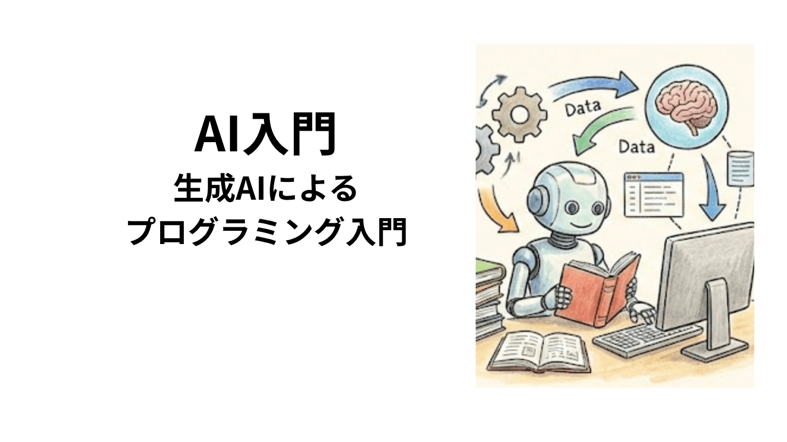

# 講義ノート

全学向けに開講している「AI入門」と「生成AIによるプログラミング入門」の講義ノートです。

講義ノートなので、全てを授業で話すわけではありません。話すかもしれない内容も全て備忘録として書いてあります。

## AI入門(A/B): 講義ノート

1. [生成AIを使ってみる](ai-introduction/01prompt.md)
<!--
2. [生成AIの仕組みと文脈](02context.md)
3. [生成AIと調査活動](03survey.md)
4. [生成AIと推論：AIは考えているのか](04thinking.md)
5. [生成AIと評価](05eval.md)
6. [生成AIと創作活動](06movies.md)
7. [AIの歴史](07history.md)
8. [AIと社会](08social.md)
9. [生成AIとプログラミング](09prog.md)
10. [データ分析と可視化](10data.md)
11. [回帰分析：アンケートデータで予測する](11predict.md)
12. [クラス分類：アンケートデータで判断する](12class.md)
13. [総合演習：自分の問いをデータで答える](13summary.md)
-->

## プログラミング入門(A/B): 講義ノート

1. [生成AIによるプログラミング](ai-programming/01getstarted.md)
2. [GitHub で作品を公開する](ai-programming/02github.md)
<!--
3. [生成AIの限界を知る](03ideathon.md)
4. [HTML・CSS・JavaScriptの役割](04html.md)
5. [関数](05function.md)
6. [Canvasで描く](06canvas.md)
7. [データの可視化](07graph.md)
8. [例示とプロンプト設計](08examples.md)
9. [アルゴリズムと可視化](09algorithm.md)
10. [オセロAIを作る：システム統合](10integration.md)
11. [ゲームAIの手法と自己分析](11game.md)
12. [チャレンジ](12challenge.md)
13. [開発プロセス](14process.md)
14. [付録 AI時代のソフトウェア開発とキャリア](15career.md)
15. [付録 言語とデータ](16lang.md)
16. [付録 プログラムの構造：入出力と関数](17structure.md)
-->

## ライセンス

この講義ノートは<a rel="license" href="http://creativecommons.org/licenses/by-nc-nd/4.0/">クリエイティブ・コモンズ 表示 - 非営利 - 改変禁止 4.0 国際 ライセンス</a>の下に提供されています。ただし、講義ノート中のコードは<a rel="license" href="https://opensource.org/licenses/MIT">MITライセンス</a>の下に提供されています。