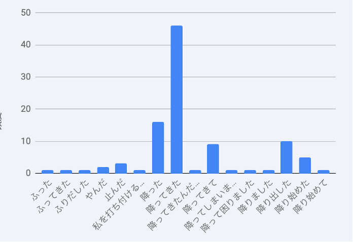
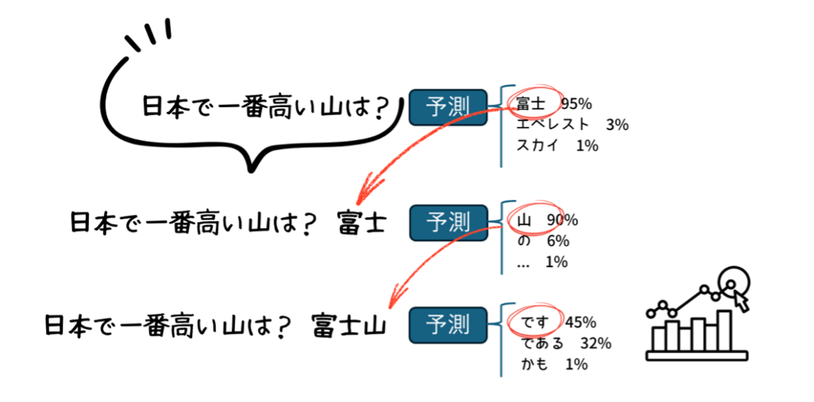
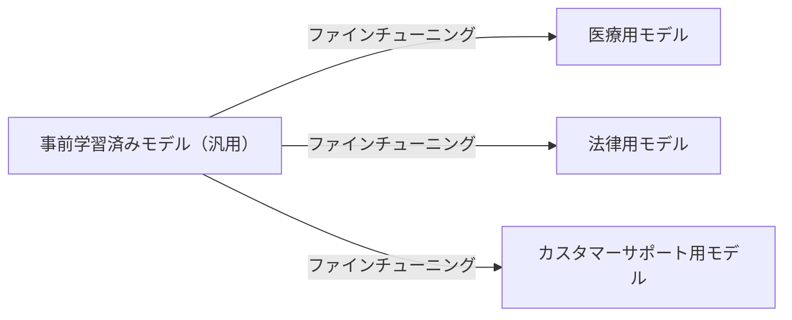
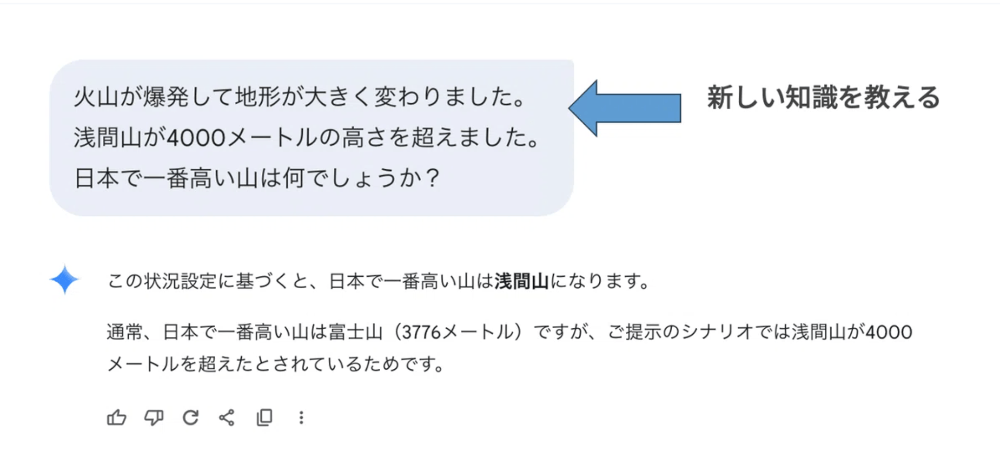

# 生成AIの仕組みとコンテキストの活用

## ゴール

- 生成AIの核心「&#8203;**単語（トークン）予測**&#8203;」を体感する
- **事前学習・ファインチューニング**&#8203;の違いを説明できるようになる
- **文脈内学習（In-context Learning）**&#8203;という現象を体験する
- 個人情報を使わずに「自分らしい文章」を生成AIに書かせる

## 1. LLMの仕組み：単語（トークン）予測

### 文章は確率的に決まっている？

「ことば」は、自然に発生してきた&#8203;**自然言語**&#8203;ですが、文法や書き方のようなルールもあります。

コンピュータが人間のことばを扱う「&#8203;**自然言語処理**&#8203;」では、まずプログラミングでルールを書くところから始まりました。でもルールどおりに処理できない例外も多く、処理するのが難しい問題でした。

そんな中、人間の音声を聞き取る音声認識という研究分野から、驚くような新しい発想が生まれてきました。

> **「ことば」は確率で処理できる**

国語や英語の授業では、文法は習いましたが、確率という話は出てきませんでした。どういうことでしょうか?

ぼくの講義では学生たちに協力してもらって、簡単な実験をして少し実感してもらっています。

みなさんも、次の中途半端な文に続く「ことば」を考えてみてください。

> **昨日、学校の帰り道に突然雨が**

学生たちの答え(n=100)を集計したものです。びっくりするほど、みんな同じ言葉を選びます。半分近い学生が「降ってきた」と続けているのです。



人間は、論理的に考えて、文法的に正しいことばを発していると信じられてきました。でも、もしかしたら、 **無意識に「こういう場面では、こういうことばを使う確率が高い」** と予測しているのかもしれないのです。

### 確率分布から文章を生成する

生成AI（大規模言語モデル、LLM）は、膨大なテキストを学習し「&#8203;**次のトークンの確率分布**&#8203;」を記憶しています。テキストをそのまま丸暗記しているわけではありません。

文章を生成するとき、確率の高いトークンを順番に選び続けます。



スマホのキーボードに表示される予測変換も、同じ原理で動いています。スマホの予測変換は&#8203;**小規模な言語モデル**&#8203;、ChatGPT や Claude は&#8203;**大規模言語モデル（LLM）**&#8203;——原理は同じで、学習データの量と複雑さが桁違いに異なります。

## 2. 事前学習・ファインチューニング・強化学習

LLMはどのように文章の確率分布を学んでいるのでしょうか、見ていきましょう。

### 事前学習（Pre-training）——図書館に住んだ人

最初の大規模な学習フェーズを&#8203;**事前学習（Pre-training）**&#8203;といいます。

子どもの頃から図書館に住み込み、Wikipedia・ニュース・小説・論文・SNS の投稿……インターネット上のあらゆるテキストを何年も読み続けた人を想像してください。

読んだテキストは膨大な量になります。

でも、その人が知っているのは「世の中一般のこと」だけです。&#8203;**あなた個人のこと**&#8203;——あなたの性格、経験、友人関係——は読んだことがないので知らない。

また、読書をやめた時点以降の出来事も知りません（&#8203;**知識のカットオフ**&#8203;）。昨日のニュースも、今日の授業も、LLM には届いていません。

### ファインチューニング（Fine-tuning）：専門家に転身

幅広い知識を持つ人が、特定の職業に就くために専門訓練を受けるイメージです。医学部卒の研修医が内科専門医になるように、汎用モデルを特定の目的に絞り込みます。



ただし事前学習だけ終えた素の GPT は、有能だけど礼儀を知らない新人のようなものでした。「役立つ・安全・丁寧」に育てるには、もう一手間必要でした。

### 強化学習（RLHF）：マナーを学ぶ

ChatGPT が公開されて「会話がこんなに自然なのか」と世界が驚いたのは、&#8203;**強化学習（RLHF：人間のフィードバックによる強化学習）**&#8203;のおかげです。

仕組みはシンプルです。

同じ質問に対して複数の回答を生成し、人間の評価者が「こちらの方がいい」と順位をつけます。良い回答には報酬を、悪い回答には罰を与え、モデルは「人間が好む回答」を出すよう学習していきます。

```
良い回答を選んでくれた → 報酬（次もこの方向で）
悪い回答と判定された → 罰（この方向は避ける）
```

犬のしつけと同じ原理です。「お手」ができたらご褒美、吠えたら叱る——繰り返すうちに犬は「何をすれば人間が喜ぶか」を覚えます。ChatGPT も同様に「人間が喜ぶ答え方」を覚えていきました。


## 3. 文脈内学習という現象

LLM にはもう一つ興味深い特性があります。&#8203;**追加学習なしに、会話の中で例を見せるだけで振る舞いが変わります。**



これを&#8203;**文脈内学習（In-context Learning）** と呼びます。

### なぜ効くのか——研究者も議論中

「効く」ことは実験で繰り返し確認されています。しかし「なぜ効くのか」は現在も研究中です。

- **タスク特定説**&#8203;：例を見ることでモデルが「何を求められているか」を正確に把握できる
- **形式の提示説**&#8203;：例の内容より、出力の形式・トーンを示すことが主に効いている

LLM の研究には「動くけど理由はわからない」という問いが多く、それ自体が現在進行形の研究テーマです。

### コンテキストに入れた知識は「学習した知識」と似た役割を果たす

文脈内学習を面白くしているのは、&#8203;**モデルの中身（学習済みの知識）は一切書き換えていない**&#8203;にもかかわらず、まるで新しいことを覚えたかのように振る舞う点です。

このとき LLM は感情分析を「学習しなおした」わけではありません。コンテキストに入れた例が、&#8203;**学習済みの知識と同じような役割** を一時的に果たしているのです。なぜそうなるのか——その原理は現在もよくわかっていません。しかしこの現象は確実に起きますし、実用上は積極的に活用できます。

この「文脈内学習」こそが、コンテキストエンジニアリングの実践的な基礎になっています。次のセクションから、どう活用するかを具体的に学んでいきます。

> [!NOTE]
> 後半では、コンテキスト（文脈内学習）を積極的に活用していきましょう。

### コンテキストウィンドウ

**コンテキストウィンドウ**&#8203;とは、モデルが一度に読める最大トークン数のことです。

| モデル世代 | コンテキストウィンドウ | 目安 |
|-----------|-------------------|------|
| 旧モデル | 4,096 トークン | 原稿用紙 約8枚 |
| 現行モデル | 128,000〜200,000 トークン | 文庫本 1〜2冊 |
| 最新モデル | 1,000,000 トークン以上 | 長編小説 数冊 |

プロンプトに書いた情報は、このウィンドウの中に入ります。LLM は&#8203;**コンテキストウィンドウの中にある情報だけ**&#8203;を使って回答します。

### RAG（参考：発展）

回答時に外部情報をリアルタイム検索して参照させる仕組みを **RAG（Retrieval-Augmented Generation）** といいます。カットオフの問題を補い、最新情報を使って回答できます。

```
通常の LLM：質問 → 学習済みの知識から回答（古い場合がある）
RAG：質問 → 外部データベース・Web を検索 → 検索結果を参照して回答
```

> [!NOTE]
> **4つの仕組みの整理**
>
> - **事前学習**&#8203;：大量データで言語・知識の基礎を習得（あなたのことは知らない）
> - **ファインチューニング**&#8203;：特定の目的・分野に合わせて追加学習
> - **強化学習（RLHF）**&#8203;：人間のフィードバックで「役立つ・安全」に調整
> - **RAG**&#8203;：回答時に外部情報を検索して補完
> - **コンテキスト（あなたが書く情報）**&#8203;：今この会話で使える知識


## 4. コンテキストエンジニアリング

「プロンプトエンジニアリング」という言葉はすでに広まっていますが、2025年6月、より大きな概念を表す言葉が注目されました。Shopify の CEO Tobi Lütke 氏がツイートで「&#8203;**コンテキストエンジニアリング（Context Engineering）**&#8203;」という表現を使い、元 OpenAI 共同創業者で元テスラ AI ディレクターの Andrej Karpathy 氏がそれに応じるツイートをしたことで、この言葉が広まりました。

**コンテキストエンジニアリング**&#8203;とは、LLM に渡す「文脈（コンテキスト）全体」を設計・最適化する技術です。単に「いい指示を書く」だけでなく、何をどの順序でどれだけ渡すかを体系的に考えるアプローチです。

この授業では「プロンプトエンジニアリング」ではなく「コンテキストエンジニアリング」という視点で、生成AIの使い方を学んでいきます。

### コンテキスト不足の典型例

就活でAIを使ったとき、こんな経験はないでしょうか。

> 「自己PRを書いてもらったけど、誰にでも当てはまる内容で使えない」
> 「志望動機が一般的すぎて、自分らしくない」
> 「何度プロンプトを直しても、似たような答えしか返ってこない」

原因をつい「プロンプトの書き方」に求めがちですが、本当の問題はAIに渡している&#8203;**文脈の不足**&#8203;です。自分固有の2種類の文脈が欠けています。

| 種類 | 就活での例 |
|------|------|
| **自分のコンテキスト** | 専攻・ゼミのテーマ・部活・アルバイト経験・強み・価値観 |
| **相手のコンテキスト** | 応募先の事業内容・求める人材像・業界が抱える課題 |

これらを渡さずにAIに「自己PRを書いて」と頼むのは、自分のことを何も知らないキャリアアドバイザーに、初対面で「完璧な自己PRを」と求めるのと同じです。文脈がなければ、どんなに優秀なAIも一般論しか返せません。

さらに、渡す文脈の&#8203;**量**&#8203;だけでなく&#8203;**質**&#8203;も重要です。どれほど高性能なモデルを使っても、与えるコンテキストが低品質であれば出力も低品質になります。これはデータ分野の古い格言に表れています。

> [!NOTE]
> **Garbage In, Garbage Out（GIGO）**
>
> 「ゴミを入れたら、ゴミが出てくる」——曖昧な経験談、矛盾した情報、的外れな例をコンテキストに詰め込んでも、回答の精度は上がりません。まず渡す情報を整理・厳選することが先決です。


### 4つの方針

AIフレームワーク「LangChain」は、コンテキストエンジニアリングの実装方針を4つに整理しています。

| 方針 | 内容 |
|------|------|
| **書き込む** | ユーザーの好みや履歴をデータベースに保存し、AIが必要時に参照する |
| **選択する** | 保存情報・外部ツールの中から、現在のタスクに関連するものだけを選んでLLMに渡す |
| **圧縮する** | 会話履歴が長くなったとき、要約や不要情報の削除でコンテキストウィンドウ内に収める |
| **分離する** | 全情報を一つのLLMに詰め込まず、処理を分担する別のAIに任せて結果だけを受け取る |

> [!WARNING]
> **コンテキストエンジニアリングの課題**
>
> コンテキストに個人の好みや行動履歴を含めると出力精度が上がる一方、管理が不十分だとプライバシー侵害につながります。また悪意のある指示をコンテキストに紛れ込ませることで、LLMが意図しない回答を生成するリスクもあります（これを&#8203;**プロンプトインジェクション**&#8203;と呼びます）。コンテキストの候補が膨大なほど、不正情報の検証も難しくなります。


## 演習：3パターン

文脈を渡すと出力が変わることを実際に体験します。ポイントは&#8203;**個人情報を使わないこと**&#8203;です。

> [!NOTE]
> **個人情報を使わない理由**
>
> 名前・住所・電話番号・生年月日などをプロンプトに入力すると、入力データがAIの学習やログに使われるリスクがあります（各サービスのプライバシーポリシーによる）。この授業の演習では個人情報を使わず、「役割・状況・強みのタイプ」だけを記述します。それで十分な文脈が作れることを体験してください。


### 演習 A：自己紹介文

**ステップ 1**&#8203;（情報なし）
```
「ゼミの初回に使う自己紹介文を100字で書いてください。」
```

**ステップ 2**&#8203;（役割と状況を加える）
```
「以下の情報を踏まえて、ゼミの初回に使う自己紹介文を100字で書いてください。

【私について（架空または大まかな情報で）】
・専攻・学部：
・好きなこと・得意なこと：
・ゼミで取り組みたいテーマや方向性：

【状況】
・相手：同じゼミの学生と指導教員
・トーン：親しみやすく、でも礼儀は保つ」
```

**ステップ 3**&#8203;（型を先に見せる）
```
「以下の型で自己紹介文を書いてください。

【型の例】
専攻と学年 → 関心テーマ → 得意なこと → ゼミへの期待

【情報】
（ステップ2の情報をここに貼る）」
```

> **比べてみよう**&#8203;：ステップ 1・2・3 で何が変わりましたか？「自分なら違う書き方をしたい」と感じた部分はどこですか？それは「まだ伝えていない文脈」かもしれません。


### 演習 B：推薦文風

教授や先輩が後輩を紹介する「推薦文」の形式を体験します。実際の個人情報は使わず、&#8203;**架空の設定**&#8203;で構いません。

```
「以下の情報を踏まえて、学生への推薦文（200字）を書いてください。

【書く立場】
・書き手：〇〇ゼミの指導教員

【推薦する学生の特徴（架空）】
・研究への取り組み方：（例：粘り強く一人で深める・グループで議論を活性化するなど）
・印象に残っているエピソード：（例：ゼミ発表でデータの矛盾を自分で発見した、など）
・強み：（例：論理的な整理が得意・フィールドワークが得意、など）

【推薦先・目的】
・宛先：インターンシップ先の担当者
・伝えたいこと：研究姿勢と人柄」
```

> **試してみよう**&#8203;：「研究への取り組み方」の部分を変えると、推薦文のトーンはどう変わりますか？

> **応用**&#8203;：立場を「サークルの先輩が後輩を紹介する」に変えて比べてみましょう。


### 演習 C：エントリーシート（ES）

就職活動のエントリーシートを架空の設定で作ります。本番前の「型の練習」として使えます。

**プロンプト例（志望動機）**
```
「以下の情報を踏まえて、志望動機を300字で書いてください。

【私について（架空または大まかな情報で）】
・専攻・学部：
・印象に残っている活動（ゼミ・部活・アルバイトなど）：
・就職活動で大切にしたいこと（就活の軸）：

【応募先について（架空でよい）】
・業界・職種：
・その業界に興味を持ったきっかけ：
・その業界が社会に果たしている役割（自分が考えること）：」
```

**まず出力を得たら、評価してもらう**
```
「上の志望動機を以下の観点で採点してください（各20点・合計100点）。

【評価基準】
・具体的なエピソードがあるか
・自分の強みが明確か
・応募先との接点が示されているか
・読んだ人に動機が伝わるか
・独自性があるか（誰にでも書ける内容でないか）

改善案も併せて提示してください。」
```

> **比べてみよう**&#8203;：「【私について】」の欄を半分だけ埋めた場合と、すべて埋めた場合で、出力の具体性はどう変わりましたか？


## まとめ

- 生成AIは「&#8203;**次のトークンの確率分布**&#8203;」を学習し、確率の高いトークンを選び続けて文章を生成する
- **事前学習**&#8203;で一般的なテキストを学習しているため、「あなた個人のこと」と「カットオフ後の情報」は知らない
- **ファインチューニング**&#8203;で特定の目的に特化させ、&#8203;**RAG** で外部情報を補う
- **文脈内学習**&#8203;：例を見せるだけでモデルの振る舞いが変わる——なぜ効くかは現在も研究中
- 個人情報は不要。&#8203;**役割・状況・強みのタイプ**&#8203;を渡すだけで「自分らしい文章」が生成できる
- プロンプトに入れるほど出力は変わる。何が足りないかを考えながら加えていくのが実践的なやり方


## 参考資料

- Tom B. Brown et al. (2020) "Language Models are Few-Shot Learners." *NeurIPS 2020.*
  GPT-3 を発表し、大規模言語モデルが少数の例だけで多様なタスクをこなせることを示した論文。

- Sewon Min et al. (2022) "Rethinking the Role of Demonstrations: What Makes In-Context Learning Work?" *EMNLP 2022.*
  Few-shot の例のラベルをランダムにしても効果が出ることを示した論文。文脈内学習の「なぜ効くのか」に迫る。
