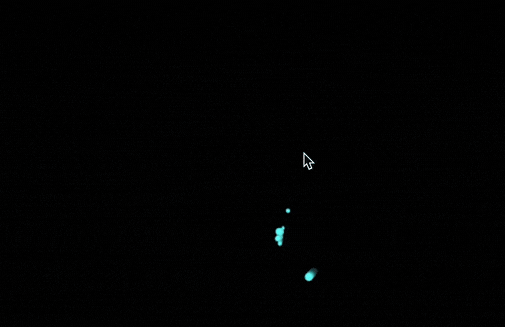
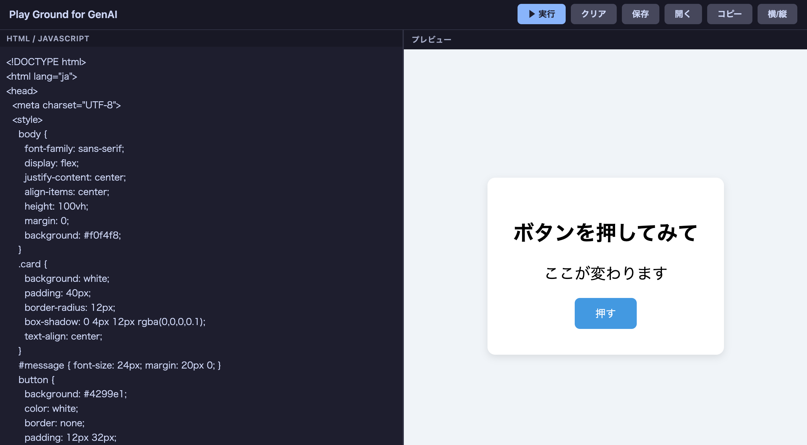

# はじめてのプログラミング

## 本日のゴール

まず、動くプログラムを作ってみましょう。



マウスの動きに反応して無数の粒子が舞うビジュアル表現を作ります。
物理シミュレーションや座標計算を含む、それなりに複雑なプログラムですが、**生成AIに依頼すれば数十秒で出力されます**。

まず動かしてみる。そこから理解を深めていく。これが今日のアプローチです。

## 1. 生成AIとプログラミング

今日、最初に使う道具は**生成AI**です。

生成AIとは、人間が与えた指示をもとに、テキスト・画像・コードなどを自動的に作り出すAIシステムです。
ChatGPT・Claude・Gemini などが代表的なサービスです。

プロンプトで指示を送ると、AIが応答を返してくれます。

> [!NOTE]
> **プロンプトとは**
>
> 生成AIへの「指示文」のことです。「〜をしてください」「〜を作ってください」のように、自然な日本語（または英語）で書きます。どれだけ的確に意図を伝えられるかが、よい出力を得るための鍵になります。


生成AIはテキストだけでなく、**プログラムのコード**も生成できます。「こんな動きをするプログラムを作って」と指示するだけで、コンピュータが実行できる形のコードを書いてくれます。

> [!NOTE]
> **コードとは**
>
> コンピュータへの命令を、プログラミング言語という専用の記法で書き記したテキストのことです。
>
> 日本語では「ここに赤い丸を描いて」と言えばわかりますが、コンピュータには「x座標100、y座標200の位置に半径50の円を赤色で描画せよ」のように、**あいまいさのない正確な命令**が必要です。その命令を書いたものがコードです。


上のアニメーションのように動きを正確に言葉で伝えるのは、実は簡単ではありません。試行錯誤しながら指示を調整していきましょう。


## 2. 演習：動かしてみる

### 今日使う実行環境

コードを動かすには「環境」が必要です。今日は **HTML と JavaScript** を使います。

- **HTML**（HyperText Markup Language）― Webページの骨格を記述する言語。「ここに見出し」「ここに画像」のように構造を指定します
- **JavaScript** ― Webページに動きを加えるプログラミング言語。ボタンの反応やアニメーションはほとんどこれで動いています

この2つは**インストール不要**で、手元のブラウザだけで今すぐ動きます。


### ステップ 1 ― プロンプトを入力する

ChatGPT・Claude・Gemini などを開き、以下のプロンプトを入力してみましょう。

```
HTML と JavaScript だけで動く、カラフルなパーティクルアニメーションを作ってください。
マウスを動かすと粒が引き寄せられるようにしてください。
1つのHTMLファイルにまとめてください。
```

**このプロンプトのポイント：**

| 書いた言葉 | なぜ必要か |
|-----------|----------|
| `HTML と JavaScript だけ` | 使う技術を指定する。指定しないと Python など別の言語で書かれることがある |
| `1つのHTMLファイルにまとめて` | ファイルが1つなら、保存してブラウザで開くだけで動く。複数ファイルに分かれると動かし方が複雑になる |

プロンプトが曖昧だと、出力もそれなりに曖昧になります。「何を・どの環境で・どの形式で」を明示するほど、意図に近い結果が得られます。


### ステップ 2 ― コードを動かす

AIが長いコードを出力します。
このコードを実行するためにファイルに保存してブラウザで開く必要があります。

意外とファイルに保存するのも手間取りますので簡単に動くサイトを作りました。
生成AIが出力したコードを左側に貼り付けると、右側でコードが動きます。

[](https://kuramitsulab.github.io/apps/pg.html)
*左側にコピペして実行*

> [!WARNING]
> 生成AIが最後までコードを出力したら、コードだけコピーしてください。
> コピペがうまくできない子もいますので気をつけて

### ステップ 3 ― 改造してみる

動いたら、指示を加えてカスタマイズしてみましょう。

> - 「粒の色を青から紫のグラデーションにしてください」
> - 「クリック時に粒が爆散するようなエフェクトを加えてください」
> - 「背景を深い紺色にして、粒が星のように見えるようにしてください」
> - 「スマートフォンのタッチ操作にも対応させてください」

プロンプトをわずかに変えるだけで出力が大きく変わります。**改造 → 確認 → また改造**、この繰り返しが AI を使った開発の基本サイクルです。

> [!NOTE]
> #### セッション
>
> 対話型の生成AIは、新しい会話を始めない限り、前の指示をや結果を覚えています。
> 追加で指示をすることができます。
>
> もし最初から指示をし直したいときは「新しい会話（セッション）」を始めてください。


## 3. 作品発表

完成したページのスクリーンショットをスクリーンに投影し、一言発表してもらいます。

- どんなデザインにしたか
- プロンプトをどう工夫したか

技術の優劣ではなく、**発想とプロンプト設計のセンス**を共有する場にします。


## 4. ディスカッション

演習を終えて、以下の問いを考えてみましょう。

**Q1. 「思い通りにならなかった」経験はありましたか？**
AIの出力がずれたとき、どう対処しましたか？言い方を変えて改善できた場合、何が変わったのでしょうか。

**Q2. コードを「書く」ことと「指示する」ことは何が違いますか？**
自分でコードを書く場合と、AIに書かせる場合で、何を理解している必要があるでしょうか。

**Q3. AIがあれば何でもできるのでしょうか？**
今日の演習でAIが対応できなかったこと、苦手だと感じたことはありましたか。


## まとめ

- 生成AIを使えば、**プログラミング未経験でも動くプログラムを即座に作れます**
- プロンプトの質（何を・どの形式で・どの環境で）が出力の質を直接左右します
- 「動いているかどうか」を確認するのは自分の役割です
- 「生成AIの限界を知る」では、自分でテーマを決めてオリジナルの作品を作ります

