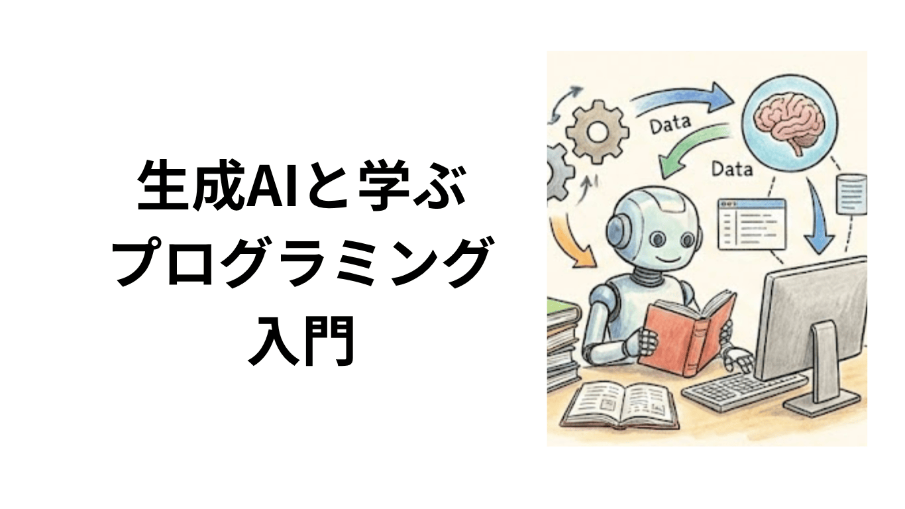
# GitHub で作品を公開する

## 今回について

前回、生成AI に書いてもらったコードをブラウザで動かしました。今度は、その作品を**インターネット上に公開**して、友達にURLを送るだけで見てもらえるようにします。

本日、使うのは **GitHub**（ギットハブ）というサービスです。

名前だけは聞いたことがあるかもしれません。

GitHub は「世界中のソースコードが集まる場所」として知られていますが、今回はそのごく入り口だけを使って、自分の HTML ファイルを世界に公開する体験をしてみます。

> [!NOTE]
> この回は新しい用語が一気に出てきます。
> 一度で全部覚えなくて大丈夫です。「こういう困りごとを、こういう仕組みで解決している」という流れを追ってください。

## GitHub の前に：そもそも「ファイルの管理」は難しい

プログラミングに限らず、レポートを書いた経験があれば、次のような状態になったことがあるはずです。

```
レポート.docx
レポート_最終版.docx
レポート_最終版_修正.docx
レポート_最終版_修正2_提出用.docx
レポート_最終版_修正2_提出用_本当に最終.docx
```

どれが「本当の最新版」か、書いた本人でもわからなくなります。しかも2人で共同編集していたら、**どちらかが相手の変更を上書きしてしまう**事故も起きます。

コードの世界では、これが何十人・何百人で起きます。「誰が・いつ・どこを変えたのか」がわからなくなると、バグが出ても原因を追えません。


## Git：変更を記録し続ける仕組み

この問題を解決するために作られたのが **Git**（ギット）です。

**Git は、ファイルへの変更を一つひとつ記録し続けるシステム**です。

Word の「変更履歴の記録」機能を、あらゆる種類のファイルに対して・チーム全員で使える形にしたもの、と考えるとわかりやすいでしょう。

### コミット：「ここまでの変更を保存する」

変更を記録する操作を **コミット（commit）** と呼びます。コミットには次の情報が刻まれます。

| 情報 | 例 |
|------|-----|
| いつ | 2026-04-15 14:32 |
| 誰が | 山田 |
| 何を変えたか | 12行目を修正、28行目を追加 |
| なぜ変えたか | 「背景色を青に変更」 |

コミットを積み重ねることで、**どの時点にもタイムトラベルして戻れる**状態ができます。「最終版_修正2_本当に最終」をファイル名で管理する必要はなくなります。

### リポジトリ：変更履歴をまとめた倉庫

コミットの記録を一つのプロジェクト単位でまとめて入れておく場所を **リポジトリ（repository）** と呼びます。

「倉庫」という意味です。今回作るのは「自分のHTMLファイルを入れるリポジトリ」です。

コミットとリポジトリの関係を図にすると、次のようになります。

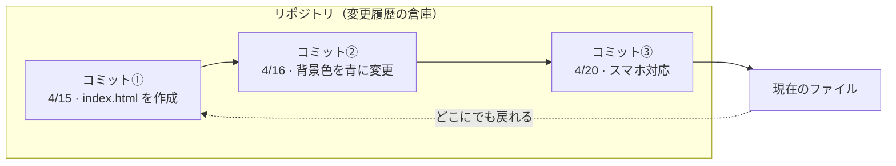

コミットを重ねるほど「タイムトラベルできる地点」が増えていきます。

## GitHub：Git をインターネットに載せたもの

Git はもともと自分のパソコンの中で動きますが、これをインターネット上で共有できるようにしたのが **GitHub** です。

GitHub にリポジトリを置くと、次のようなことができます。

- 他の人が自分のコードを閲覧できる
- チームで同じリポジトリに変更を記録できる
- 他人のプロジェクトにバグ修正を提案できる（OSSへの貢献）
- **リポジトリを Web ページとして公開できる（GitHub Pages）** ← 今回これをやります

> [!NOTE]
> GitHub は「Git のためのSNS」と言われることもあります。プロフィールページには自分が公開しているリポジトリや、他人のプロジェクトへの貢献履歴が並びます。エンジニアは採用時にこのページを見せることが多く、**プログラマのポートフォリオ**として機能します。


## 知っておきたい用語（ざっくり）

今回の作業で出てくる用語を、先に一望しておきます。すべてを完璧に理解する必要はありません。「聞いたことがある」状態を作るのが目的です。

| 用語 | 意味 |
|------|------|
| **リポジトリ** | ファイルと変更履歴をまとめた倉庫 |
| **コミット** | 変更を「ここまでの状態」として記録すること |
| **ブランチ** | 本番を壊さずに試作するための「枝分かれ」 |
| **プルリクエスト** | 「この変更を取り込んでください」とチームに提案する仕組み |
| **フォーク** | 他人のリポジトリを自分用にコピーする操作 |
| **GitHub Pages** | リポジトリ内の HTML を Web ページとして公開する機能 |

ブランチやプルリクエストは、複数人で開発するときに威力を発揮する仕組みで、詳しくは後の回（あるいはソフトウェア工学の授業）で扱います。今回は **「リポジトリを作って、ファイルを入れて、Pages で公開する」** の3ステップに集中します。


## 公開手順

### 1. アカウントを作る

[github.com](https://github.com) で無料アカウントを作成します。

> [!NOTE]
> **アカウント名は慎重につけてください。** 就職活動で見られることがあります。学籍番号や本名をそのまま使うのは避け、今後も使える名前を選びましょう。一度作ると名前は変更できますが、リンク切れの原因になるので最初が肝心です。

### 2. フォークする

**フォーク**とは、他人のリポジトリを「自分のアカウントにまるごとコピーする」操作です。コピーなので、元のリポジトリを壊す心配なく自由に編集できます。

今回は、教員の用意したリポジトリをフォークします。

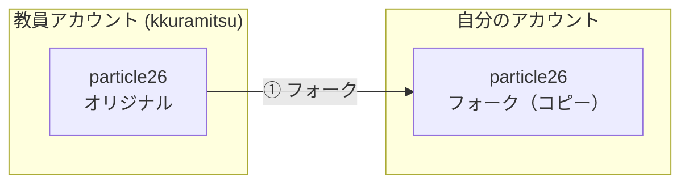

[https://github.com/kkuramitsu/particle26/](https://github.com/kkuramitsu/particle26/)

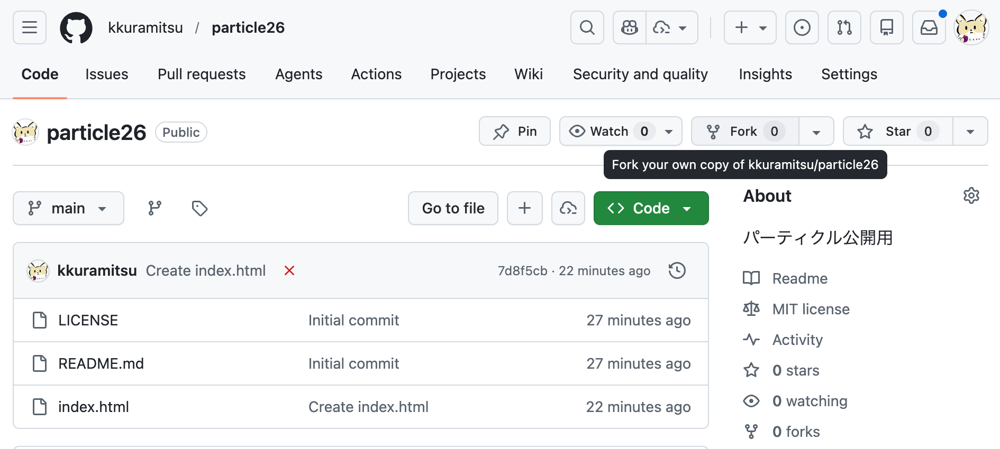

>[!note]
> レポジトリは誰のアカウントのレポジトリーか意識するようにしましょう。

### 3. ファイルをアップロードする

1. フォークした自分のリポジトリページで「＋」→「Create new file」を選択します 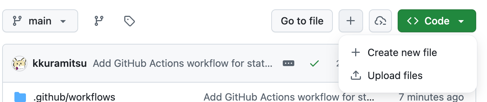

2. `index.html` というファイルを作り、コードを貼り付けてください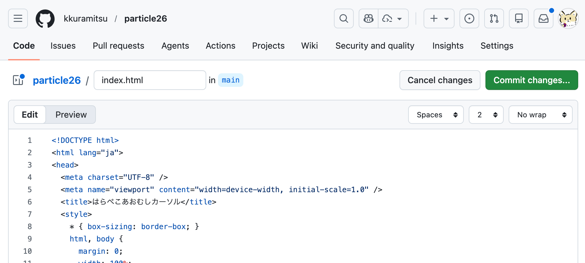

3. 緑色の「Commit changes」をクリックします

ここで「Commit changes」をクリックした瞬間が、**最初のコミット**です。「誰が・いつ・何を変えたか」がリポジトリに記録されます。

### 4. GitHub Pages で公開する

1. リポジトリの「Settings」タブを開きます
2. 左メニューの「Pages」を選択します
3. 「Branch」を `main` に設定して「Save」をクリックします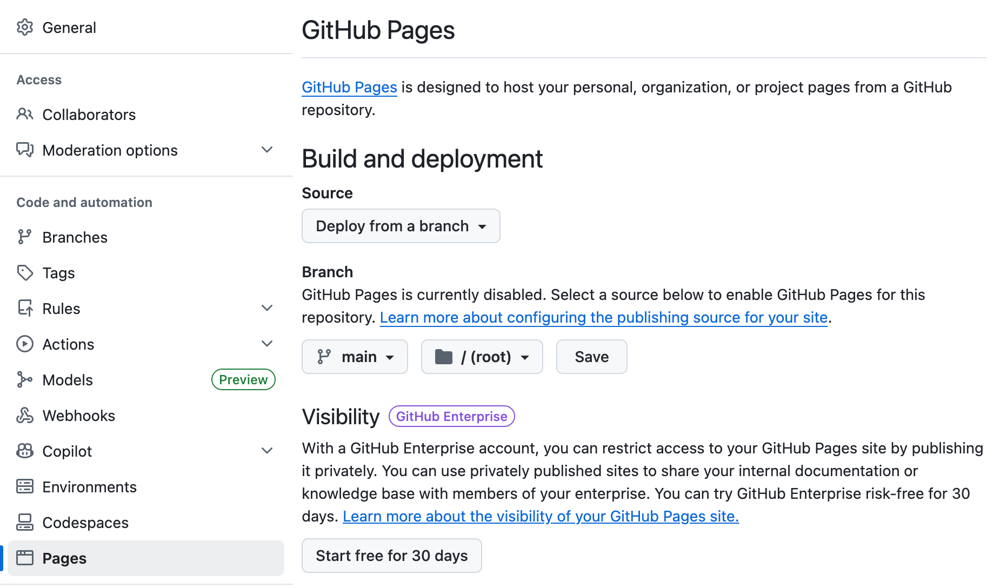

数分後に `https://ユーザー名.github.io/リポジトリ名/` という URL が発行されます

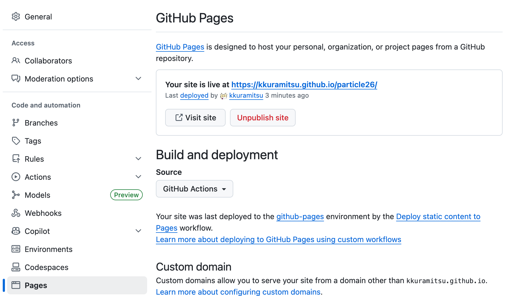


この URL をクラスメートや家族に送れば、誰でもブラウザで作品を見られます。

### 2. リポジトリを作る (フォークの代わりに)

1. ログイン後、右上の「＋」→「New repository」を選択します
2. Repository name に任意の名前（例：`particle26`）を入力します
3. 「Public」を選択します（誰でも見られる公開設定）
4. *「Add a README file」にチェックを入れます*
5. 「Create repository」をクリックします

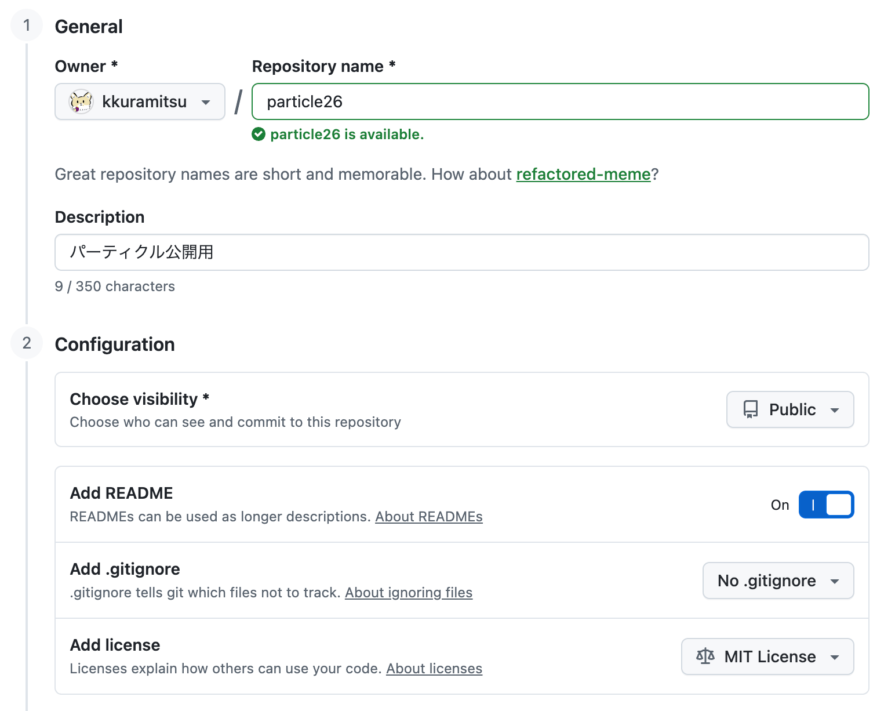

これで、世界に1つの「自分だけのリポジトリ」がネット上にできました。


## 公開後のサイクル

修正したいときは、同じ流れを繰り返すだけです。

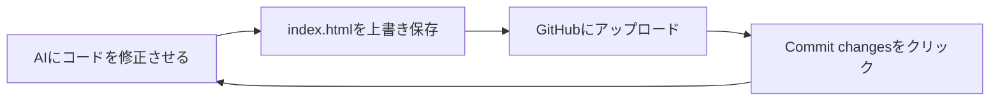

このサイクルは、実際の Web サービスで行われている**デプロイ（公開作業）のフロー**と本質的に同じ構造です。Amazon も X（旧Twitter）も、裏では同じように「変更をコミットして、自動で公開」を繰り返しています。


## AI と人間の分業

コードを書くのは AI、確認して責任を持つのは人間——この授業ではそういう分業で進めます。

AI は優秀ですが、**「動くけど意図と違う」コードを書くことがあります**。作文の添削を頼んだら、文法は正しいのに言いたいことと全然違う文章が返ってきた、という感覚に近いです。

### コミットを「確認の証」にする

だから、**「AI が書いたコードをブラウザで確認してからコミット」** というリズムが大切です。

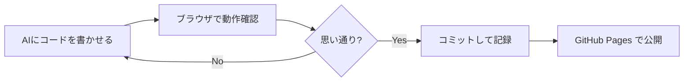

コミット履歴が「自分が確認・承認した記録」になります。何かおかしくなっても、前のコミットに戻すだけで安全な状態に戻れます。

### コミットメッセージは「未来の自分へのメモ」

コミットするとき、一言メモを残せます。技術的な詳細より「なぜそうしたか」を書くのがポイントです。

| 悪い例 | 良い例 |
|--------|-------|
| `修正` | `背景色を青に変えた` |
| `更新` | `スマホで止まらないバグを直した` |
| `AI` | `AIに依頼・動作確認済み` |

半年後に見返したとき「このコード、何のためだっけ？」とならないための一言です。


## GitHub を知っておく価値

プログラマになる予定がなくても、GitHub は役に立ちます。

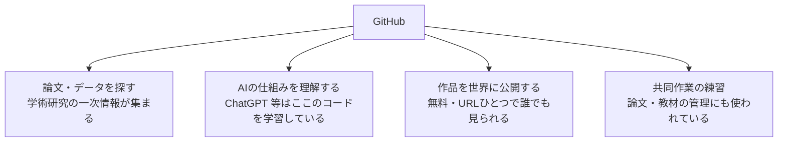

「とりあえず公開してみる」という経験は、専攻に関わらず、デジタルで何かを発信する力の土台になります。


## 参考リンク

- [GitHub](https://github.com) ― アカウント作成はここから
- [GitHub Pages 公式ドキュメント](https://docs.github.com/ja/pages) ― 困ったときの一次情報
- [ChatGPT](https://chat.openai.com) / [Claude](https://claude.ai) / [Google Gemini](https://gemini.google.com) ― エラーが出たら貼り付けて聞く
