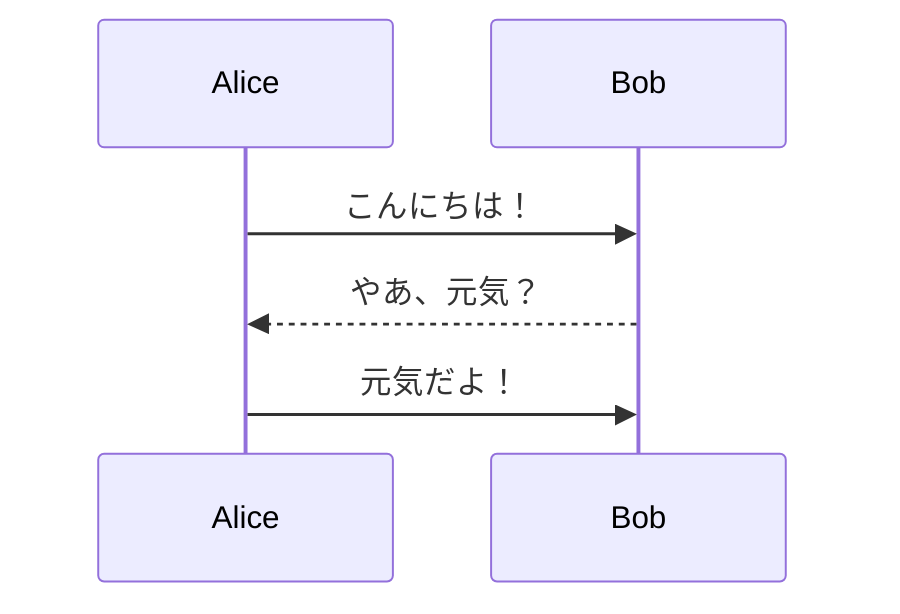
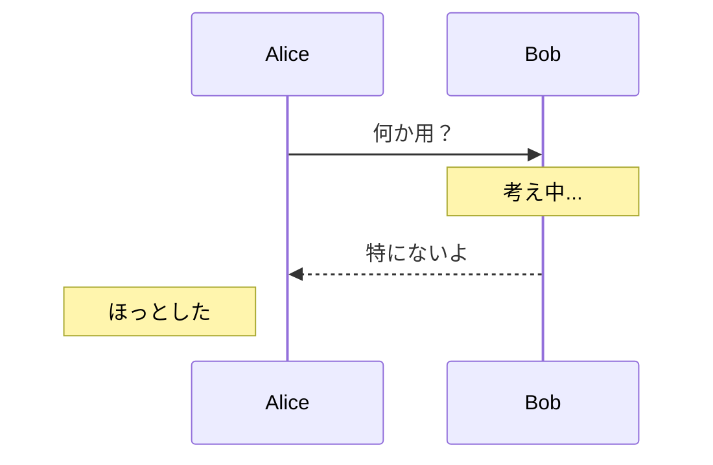

# Mermaid 記法メモ

```mermaid
  info
```

## 1. 通常のフローチャート（基本形状）


## 2. 非対称形（吹き出し風・旧来の方法）

`>text]` 記法は右向きのリボン／吹き出し風に見える。


## 3. Mermaid v11+ の callout シェイプ

v11 以降では `@{ shape: callout }` が使える（対応環境が必要）。

```mermaid
flowchart LR
    A["人物A"] --> B@{ shape: callout, label: "Hello, World!" }
```

## 4. シーケンス図（会話表現に向いている）

吹き出しより**シーケンス図**のほうがセリフ表現には自然。



## 5. ノート（note）を吹き出し代わりに使う



## まとめ

| 目的 | おすすめ記法 |
|------|-------------|
| 吹き出し（旧来） | `>text]` （非対称形） |
| 吹き出し（v11+） | `@{ shape: callout }` |
| セリフ・会話 | `sequenceDiagram` |
| 注釈 | `Note over X:` / `Note left of X:` |
