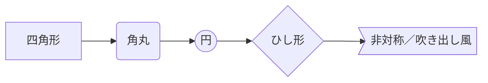
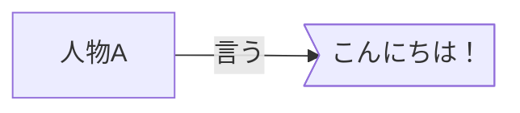
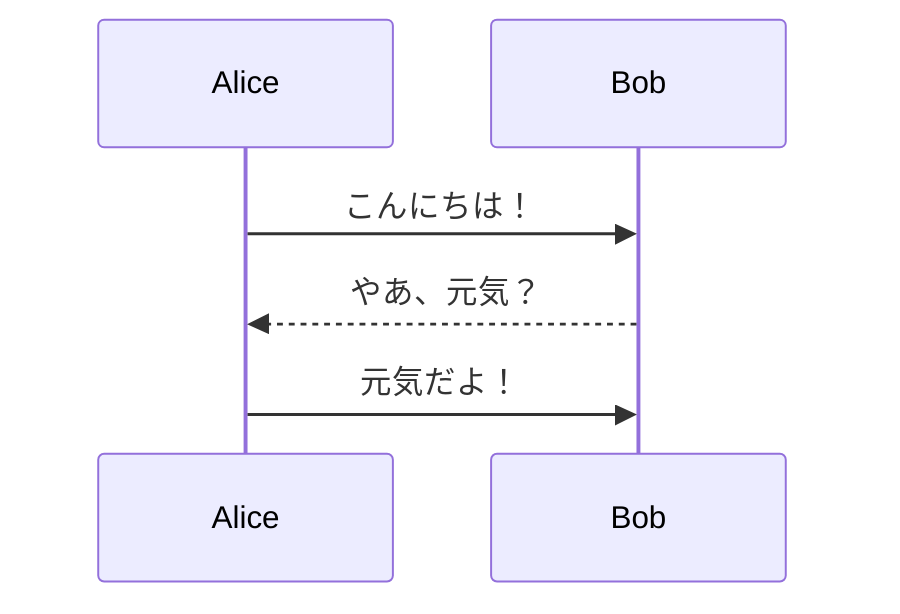
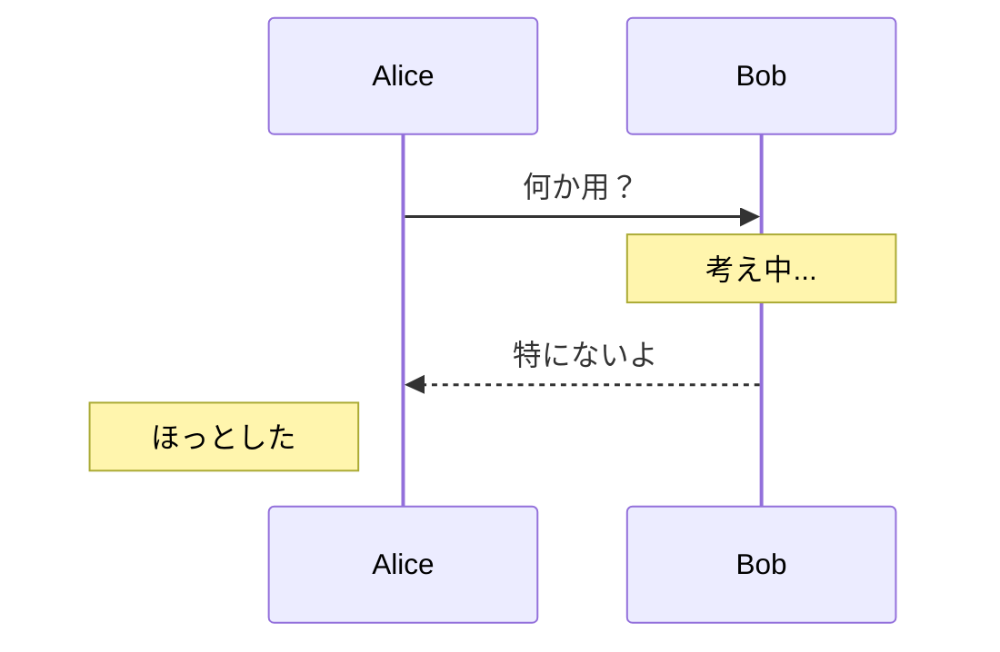

# Mermaid 記法メモ

```mermaid
  info
```

## 1. 通常のフローチャート（基本形状）



## 2. 非対称形（吹き出し風・旧来の方法）

`>text]` 記法は右向きのリボン／吹き出し風に見える。



## 3. Mermaid v11+ の callout シェイプ（GitHub 非対応）

v11 以降では `@{ shape: callout }` が使えるが、**GitHub の Mermaid レンダラーは未対応**のためエラーになる。
GitHub で吹き出しを表現したい場合は `>text]`（非対称形）か `sequenceDiagram` の `Note` を使うこと。

## 4. シーケンス図（会話表現に向いている）

吹き出しより**シーケンス図**のほうがセリフ表現には自然。



## 5. ノート（note）を吹き出し代わりに使う



## 6. SVG 吹き出し（GitHub 対応）

GitHub は `<svg>` タグの直書きや `data:` URI を **許可しない** が、
リポジトリに置いた `.svg` ファイルを `` で参照するのは **可能**。

### 吹き出し SVG の例


SVG の構造：

```xml
<svg xmlns="http://www.w3.org/2000/svg" width="200" height="90" viewBox="0 0 200 90">
  <!-- 吹き出し本体＋しっぽ（path で一筆書き） -->
  <path d="M 10,0 L 190,0 Q 200,0 200,10 L 200,60 Q 200,70 190,70
           L 55,70 L 40,85 L 35,70 L 10,70 Q 0,70 0,60 L 0,10 Q 0,0 10,0 Z"
        fill="#fff9c4" stroke="#555" stroke-width="1.5" stroke-linejoin="round"/>
  <text x="100" y="40" text-anchor="middle"
        font-family="sans-serif" font-size="15" fill="#333">Hello, World!日本語もでますか？</text>
</svg>
```

**制約：**
- テキストは SVG ファイルに埋め込み固定（動的変更不可）
- 日本語フォントはシステム依存（sans-serif 指定で概ね表示される）
- Mermaid のように矢印と組み合わせた図は作れない

### 複数キャラクターの会話例


吹き出しの `<path>` は一筆書きで描く。しっぽの方向で話者を区別する：

| 話者 | 配置 | しっぽ方向 |
|------|------|-----------|
| Alice | 左寄せ | 左下（← Alice 側） |
| Bob | 右寄せ | 右下（→ Bob 側） |

```xml
<!-- 左側の吹き出し（しっぽ：左下） -->
<path d="M 80,10 L 310,10 Q 320,10 320,20 L 320,70 Q 320,80 310,80
         L 90,80 L 42,100 L 80,80 Q 70,80 70,70 L 70,20 Q 70,10 80,10 Z"
      fill="#e8f4fd" stroke="#4a90e2" stroke-width="1.5" stroke-linejoin="round"/>

<!-- 右側の吹き出し（しっぽ：右下） -->
<path d="M 170,110 L 400,110 Q 410,110 410,120 L 410,170
         L 438,200 L 400,180 L 170,180 Q 160,180 160,170 L 160,120 Q 160,110 170,110 Z"
      fill="#fdeee8" stroke="#e27b4a" stroke-width="1.5" stroke-linejoin="round"/>
```

### 生成AIプロンプト風の吹き出し

ユーザーのプロンプトと AI の応答を視覚的に区別する。


| 役割 | 配置 | 背景色 | しっぽ |
|------|------|--------|--------|
| あなた（プロンプト） | 右寄せ | `#1e88e5`（濃い青）・白文字 | 右下 |
| AI（応答） | 左寄せ | `#f3e5f5`（薄い紫）・紫枠 | 左下 |

```xml
<!-- ユーザーのプロンプト（塗りつぶし・枠なし） -->
<path d="M 112,10 L 418,10 Q 430,10 430,22 L 430,70
         L 455,95 L 418,80 L 112,80 Q 100,80 100,70 L 100,22 Q 100,10 112,10 Z"
      fill="#1e88e5"/>
<text ... fill="white">AIで絵を描くにはどうすればいい？</text>

<!-- AI の応答（薄い塗り＋枠あり） -->
<path d="M 37,115 L 355,115 Q 367,115 367,127 L 367,193 Q 367,205 355,205
         L 75,205 L 15,228 L 52,205 Q 25,205 25,193 L 25,127 Q 25,115 37,115 Z"
      fill="#f3e5f5" stroke="#9c27b0" stroke-width="1.5" stroke-linejoin="round"/>
<text ... fill="#9c27b0">✦ AI</text>
```

## まとめ

| 目的 | おすすめ記法 |
|------|-------------|
| 吹き出し（旧来） | `>text]` （非対称形） |
| 吹き出し（v11+・GitHub非対応） | `@{ shape: callout }` |
| 吹き出し・単発（SVG） | `images/callout.svg` を `` で参照 |
| 吹き出し・会話（SVG） | `images/conversation.svg` を `` で参照 |
| プロンプト→AI応答（SVG） | `images/ai_prompt.svg` を `` で参照 |
| セリフ・会話 | `sequenceDiagram` |
| 注釈 | `Note over X:` / `Note left of X:` |


#### プロンプト A


#### プロンプト B


